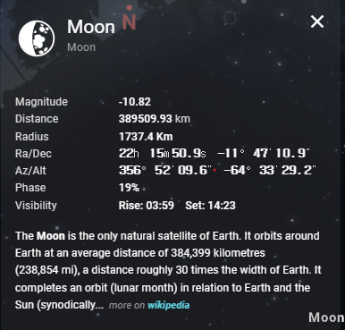
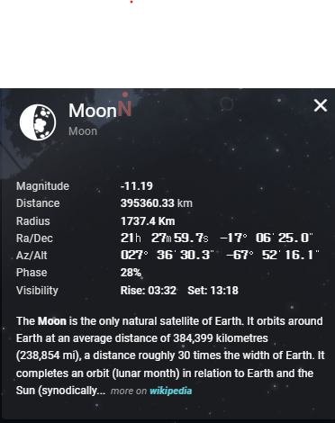
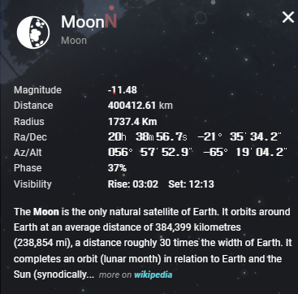

# Week 3 Moon Data Cross-check (KASI + Stellarium)

## 목적
KASI 달 데이터와 Star-Index 반영값을 비교해 센티넬 케이스를 확인하고, 팀 정책 합의에 필요한 근거를 남긴다.

## 테스트 대상
- 고정 spotId: `2415b93c-cc7c-4b8f-bb9d-a2cd4f797bae`
- 명소명: 강원 인제 원대리

## A. KASI 달 데이터 검증

### A-1. 원본 조회 결과 (`GET /sky/moon`)

| date | moonAltitude | moonAltitudeKnown | lunPhase | moonrise | moonset | lunAge | 판정 |
|---|---:|---|---:|---|---|---:|---|
| 20260413 | -10 | false | 0.8610169491525423 | 0338 | 1427 | 25.4 | 센티넬 |
| 20260412 | -10 | false | 0.8271186440677966 | 0309 | 1322 | 24.4 | 센티넬 |
| 20260411 | -10 | false | 0.7932203389830508 | 0236 | 1218 | 23.4 | 센티넬 |

### A-2. Star-Index 반영 확인 (`GET /star-index?spotId=...`)

- 공통 결과
  - `moon_altitude_deg = -10`
  - `moon_altitude_known = false`
  - `moon_effect_score = 100`
  - `score = 82`
  - `moonKey = moon:20260413`

### A-3. 해석
1. `moonAltitudeKnown=false` + `moonAltitude=-10` 조합은 달 고도 미확정(센티넬) 케이스다.
2. 현재 로직에서는 센티넬 케이스일 때 달 감점이 적용되지 않아 `moon_effect_score=100`으로 계산된다.
3. `GET /star-index`는 서버의 오늘 날짜 moon 캐시 키(`moon:${today}`)를 사용하므로, `sky/moon?date=...`의 과거 날짜 조회값과 즉시 1:1 대응되지 않는다.

## B. Stellarium 크로스체크 (3케이스 스냅샷)

### B-1. Case 1 (20260413)

### B-2. Case 2 (20260412)

### B-3. Case 3 (20260411)

### B-4. 비교 기준
- 비교 항목: 위상(phase), 월출(moonrise), 월몰(moonset), 고도(altitude)
- StarChaser 고도는 센티넬(`-10`, `moonAltitudeKnown=false`)이므로 고도 정량 비교는 보류
- `sky/moon`은 date 단위 응답이므로 time 파라미터 기반 정밀 비교는 현 단계에서 제한됨

### B-5. 정량 비교 결과 (팀 공유용)

| 케이스 | 날짜 | 위상(StarChaser) | 위상(Stellarium) | 위상 차이(%p) | 월출 차이 | 월몰 차이 | 고도 비교 |
|---|---|---:|---:|---:|---|---|---|
| Case 1 | 20260413 | 86.10% | 19% | 67.10 | +21분 (03:38 -> 03:59) | -4분 (14:27 -> 14:23) | 불가(센티넬) |
| Case 2 | 20260412 | 82.71% | 28% | 54.71 | +23분 (03:09 -> 03:32) | -4분 (13:22 -> 13:18) | 불가(센티넬) |
| Case 3 | 20260411 | 79.32% | 37% | 42.32 | +26분 (02:36 -> 03:02) | -5분 (12:18 -> 12:13) | 불가(센티넬) |

### B-6. 결과 해석 (쉽게 보기)
- 월출은 Stellarium이 StarChaser보다 일관되게 21~26분 늦게 나타남
- 월몰은 Stellarium이 4~5분 빠르게 나타남
- 위상 수치 차이는 42~67%p로 큼 (단순 오차보다는 지표 정의 차이 가능성 높음)
- 고도는 StarChaser가 3케이스 모두 센티넬이라 정확도 비교 결론을 내릴 수 없음

### B-7. 이번 검증에서 확인된 점 / 미확인 점
- 확인 완료: 날짜별 KASI 값 변화, 센티넬 발생 패턴, Stellarium 스냅샷 3건 확보
- 미확인(보류): 고도 정확도 정량 비교, 날짜별 Star-Index 직접 반영 비교

## C. 팀 정책 합의 필요사항
- 센티넬(-10) 발생 시 정책: 달 감점 100 유지 vs 보수적 기본 감점 적용
- `moon_altitude_known=false` 상태의 사용자 안내 문구 필요 여부
- 날짜 지정 검증 강화를 위해 `star-index`에 기준 날짜 파라미터를 둘지 검토

## D. 팀 공유용 한 줄 요약
KASI 3케이스(20260411~13)에서 `moonAltitude=-10`, `moonAltitudeKnown=false`가 반복되어 센티넬 처리됨을 확인했고, Stellarium 비교에서는 월출(+21~26분), 월몰(-4~-5분) 차이가 반복됐다. 위상은 큰 차이(42~67%p)가 있어 지표 기준 정합성 검토가 필요하며, 고도는 센티넬로 인해 정량 비교를 보류한다.
